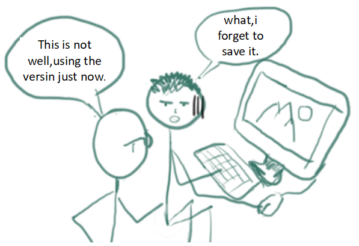

# Chapter 2: Git、Github与Gitbook

### 1. Git、Github

**Git is a kind of version controller tool，Github is an open source platform that can storage your own project**.

• You have the plan A，and after discussion you change to B.Some hours later,you still feel the plan A is better,but at that time,you forgot to save it,so you need to change it throuth your memory.But in Github you don't need to worry,because it can record each version and put them into the repository,every change is one commit,so you can rollback to any version.

• In addition you are likely to encounter the case of the derivative of the project.On the basis of scheme A，you change it to B or C，and sometimes B1、B2 or C1、C2,so the braches in github can record the procedure of this differentiation.

• Later, you think the B1 and C2 programs are desirable,they can be integrated into the finalized,of course,Git can also support this branch merge.

### 2. The Cooperative Mechanism in Github

• In a slightly larger team, it may need a few designers to complete a project, how to unified progress, one is that everyone every day to copy the file together, which requires a lot of time to synchronize the file, obviously not convenient. The other one is leaving the project in one's own computer, when needed then synchronize them through the cloud server, Git is such a so-called distributed system. The benefits are safer and more convenient.

• Then the question comes out,if two people change the same file at the same time,how to solve the conflict? Don't worry, Git will help you compare and tell you where the conflict is, you can make a choice for the conflict or choose which part can be reserved.

### 3. The relationship between Github and Gitbook

**Similarities:**

1. Both of them are based on Git,so they have versin control functions.

&#x20; 2\. They can add collaborators to their repositories.

Based on the reasons above:For a Gitbook project, if you do not need someone other than collaborators, and collaborators are familiar with Gitbook and follow the rules, at this time you do not need to use Github

**Differences:**

1. Gitbook focus on book compilation and publishing,version control function is limited.

&#x20; 2\. GitHub is a professional code hosting platform with improved version control functions, such as pull request, issues and other functions

Based on the reasons above:For a Gitbook project,if you want to accept the public's contribution, or not familiar with the rules, you should use GitHub's pull request function to achieve the responsibility of the code control.
