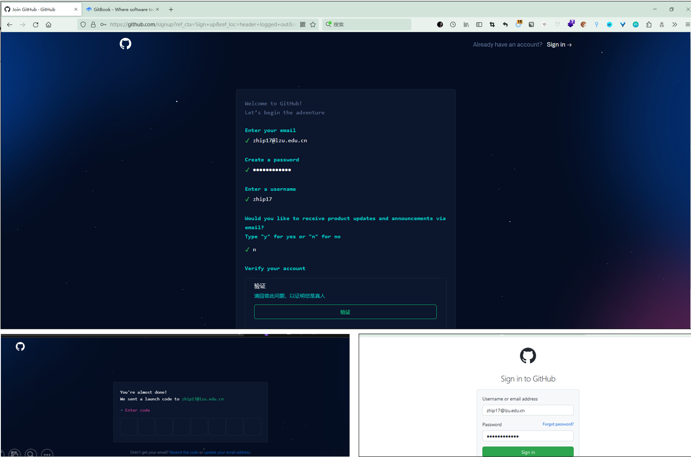
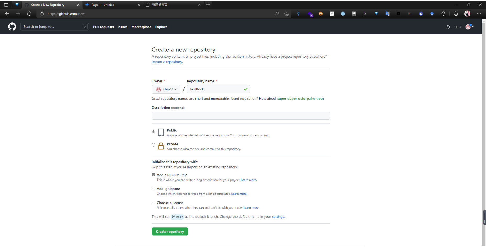
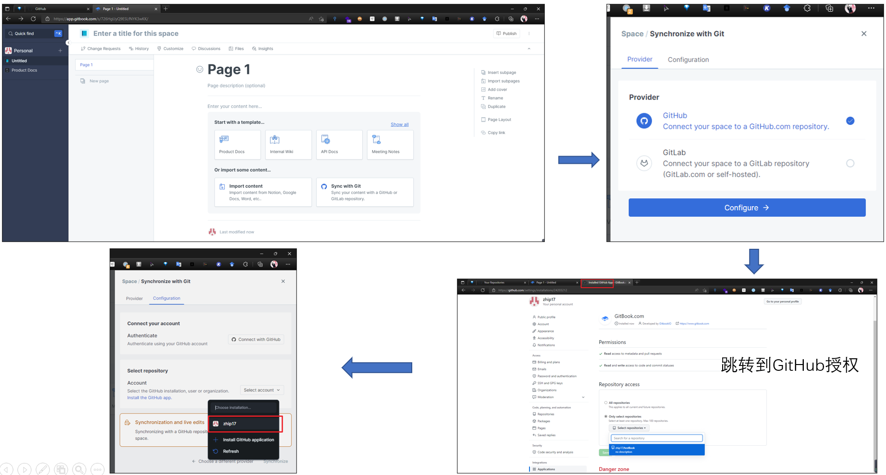
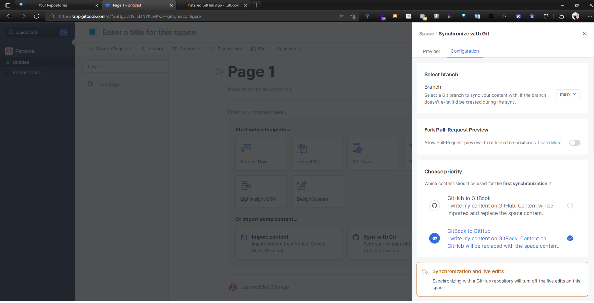
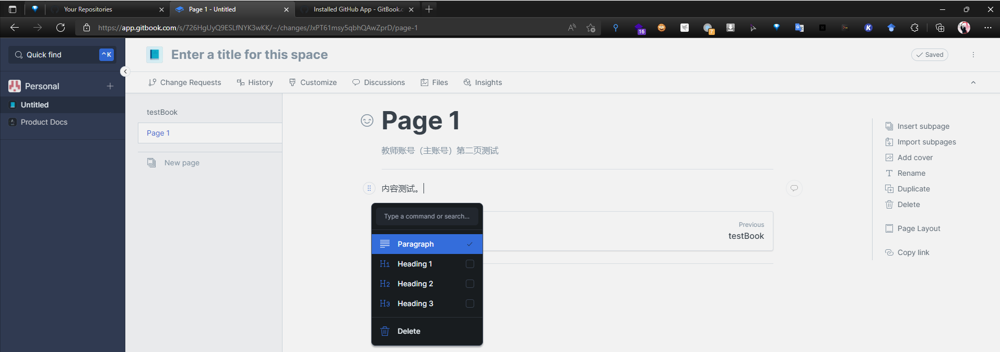
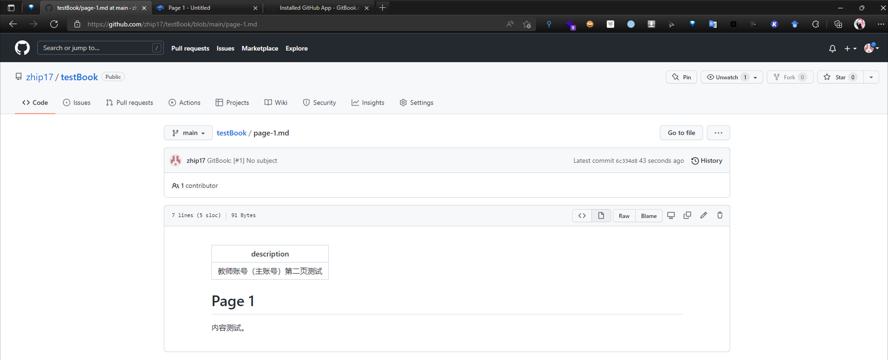

# Chapter 4: Create the book and make connection with Github repository

***

1. First, you need to log in to http://github.com/, register a Github account, click sign up and follow the prompts to register step by step.

&#x20;2\. After you have a Github account, you can now create a new repository in Github for subsequent association with GitBook.

3\. Once you have a Github account, you don't need to sign up for Gitbook separately. Log in to https://www.gitbook.com/, click Sign Up With Github, you can register and log in to Gitbook through your Github account.

4\. We enter the Gitbook, create a space, select Sync with Git, follow the instructions to authorize step by step, select the repository and branch, and finally realize the function of collaboration through the Github repository.

5\. Choose a course writing method

&#x20;(1) Compose through GitHub and synchronize to GitBook;&#x20;

&#x20;(2) Write on GitBook and synchronize to Github; If you like to use a local editor (such as Typora), you can choose the first method; if you like to edit online, it is more convenient to choose the second method.&#x20;

Here we choose method 2 for demonstration.

6\. After establishing the connection between github and gitbook, we can write books.

7\. After the writing is complete, the content will be automatically synchronized and updated to the Github repository.

9\. The collaborator repeats the above operation to associate the fork's github repository with the gitbook. After the association is successful, the collaborators write the course content in GitBook, and the system will automatically synchronize to their Github repository.

**Through the above process, the repository of books on GitBook has been associated with the repository of books on GitHub. In the future, you can write books through GitBook or submit updates to GitHub, which greatly facilitates the collaborative writing of a textbook by multiple people.**

Later, you can read or download books online at https://username.gitbook.io/repository\_name/.
