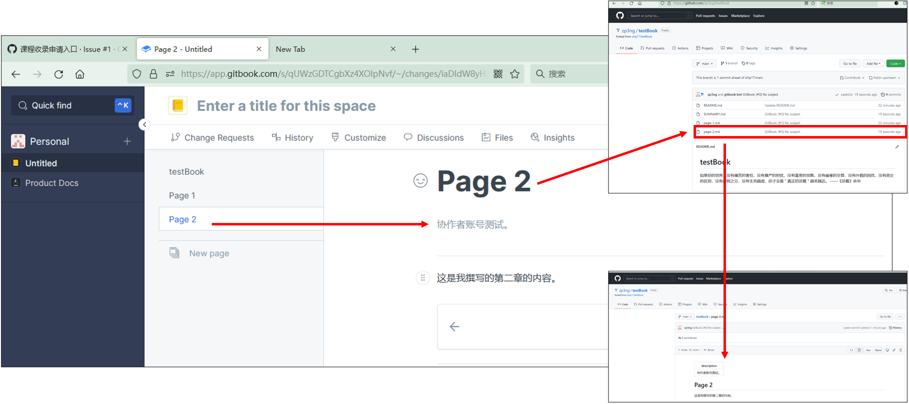
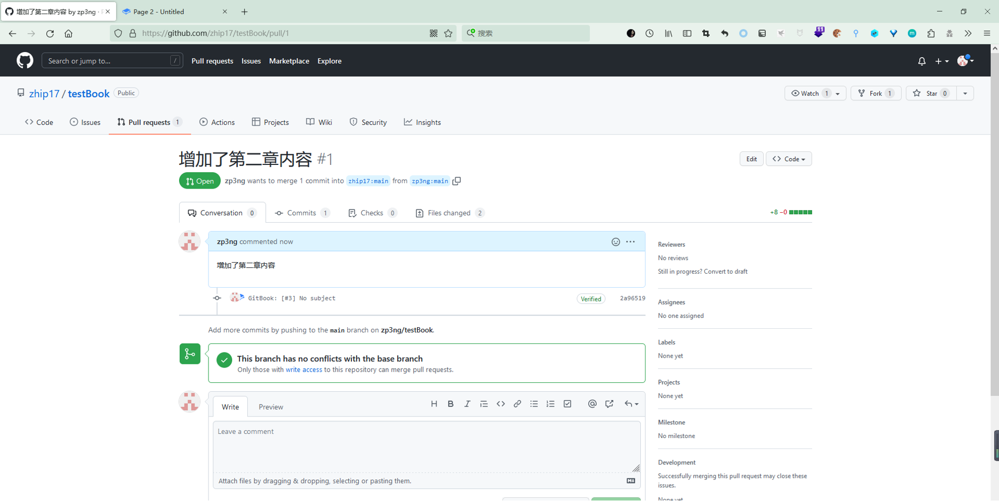
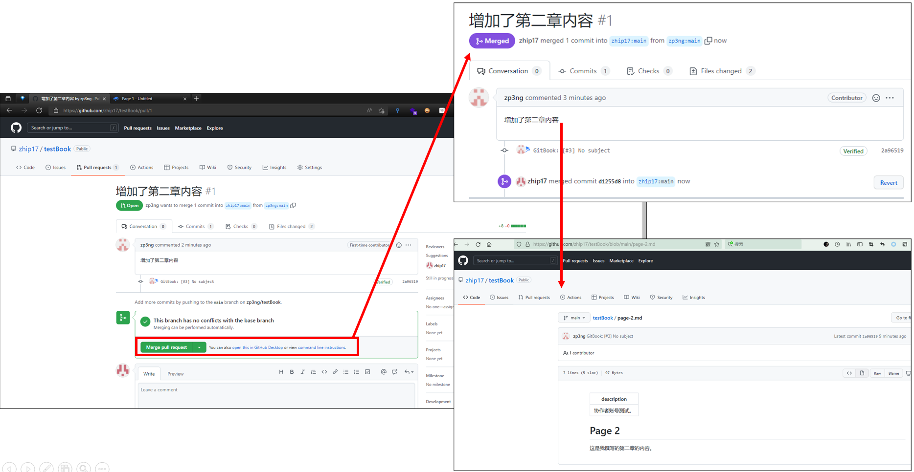

# Chapter 5: Fork repositories and pull request

We know that the github is open source，so you create a book（a repository）,anyone can see it on the website.If you find some problems about other people's code or you want to help others edit the book.You can fork them to your own github，after some changes，send a merge request to the author，if the author find you are right，he can merge your request to achieve collaborative cooperation function.

We also take the book test\_book as an example. We have already mentioned the creation process of this book in the previous section. Let's use the Github account zhip21 as the student account:&#x20;

* Fork the testBook repository we just created.&#x20;
* Writing course content in Gitbook&#x20;
* Send a pull request

1. Enter the test\_book repository **** address given by the teacher, and then fork, "Fork" is to copy someone else's repository **** to your own account.

2\. Log in to your Gitbook account, create a space and associate the repository you just forked. After the association is successful, the collaborators write the course content in GitBook, and the system will automatically synchronize to their Github repository.

3\. After the collaborators have finished writing, submit the course content to the course subject or teacher through a pull request on GitHub.

4\. At this time, the teacher will get the pull request information on Github, click the pull request, and click into the test repository **** . At this time, the teacher will read the information, and if it can be merged, click the green button Merge pull request, or reply to the Comment.

