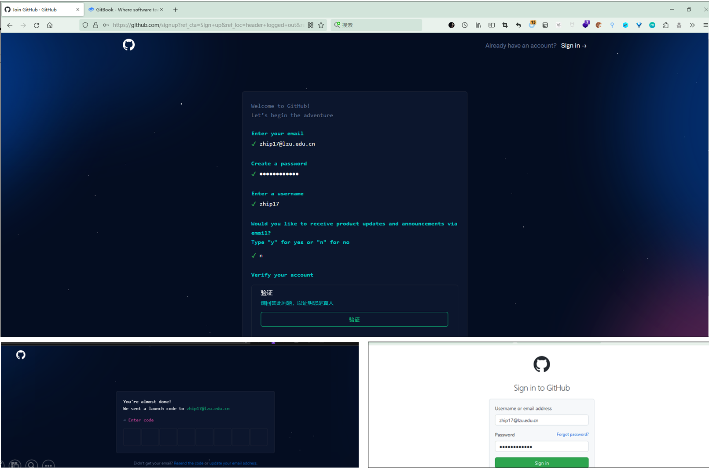
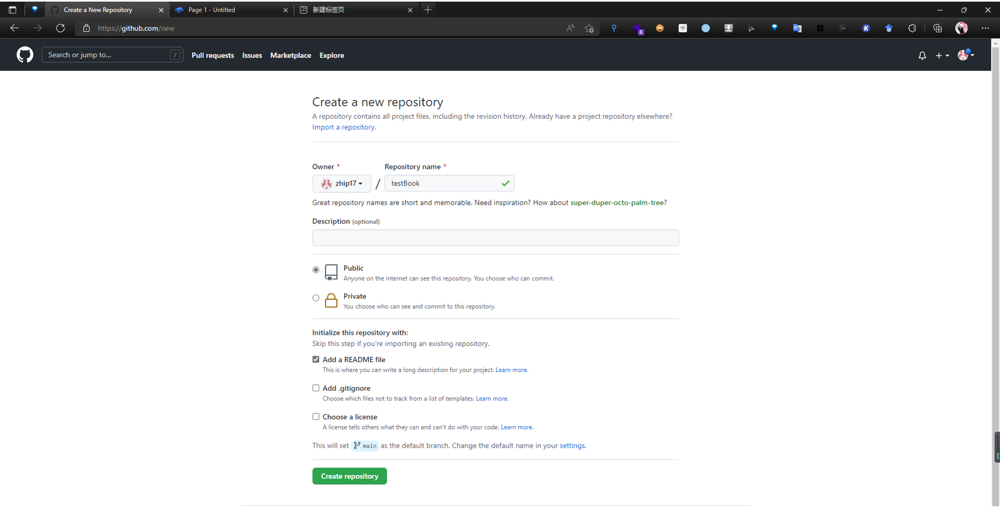

# 四、创建书并关联GitHub仓库

1. 首先，你需要登陆[http://github.com/](https://github.com)，注册一个Github账号，点击sign up按照提示一步步注册即可。

&#x20;2\. 有了Github账号后，现在Github中新建仓库，用于后续关联GitBook。&#x20;

3\. 有了Github账号后，你可以不用再去单独注册Gitbook了。登陆[https://www.gitbook.com/](http://www.gitbook.com)， 点击Sign Up With Github，即可通过Github账号注册登录Gitbook。

4\. 我们进入Gitbook中，创建一个space，选择Sync with Git，按照指示一步步授权，选择仓库和分支，最终通过Github仓库来实现协同合作的功能。

5\. 选择课程撰写方式

（1）通过GitHub撰写，同步至GitBook；

（2）在GitBook上撰写，同步至Github；

如果你喜欢用本地的编辑器（如Typora），可以选择方式一；如果喜欢在线编辑，选择方式二更方便些。此处我们选择方式二进行演示。

6\. 建立了github与gitbook的联系以后，我们就可以安静的写书了。

7\. 编写完成后，内容会自动同步并更新至Github仓库。

8\. 对于协作者，可先按上述步骤，准备自己的Github和GitBook账户。然后登录自己的Github账号，搜索课程仓库，并Fork。 _“Fork”就是把一个别人的仓库复制到自己的帐户中来。_ &#x20;

9\. 协作者重复上述操作，将Fork的github仓库与gitbook关联。关联成功后，协作者在GitBook撰写课程内容，系统将自动同步至其Github仓库。

**通过上述过程，已经将GitBook上书的仓库和GitHub上书的仓库关联起来了，以后既可以通过GitBook写书，也可以将更新提交到GitHub，极大的方便了多人协作撰写一本课本。**

**以后就可以通过**[**https://username.gitbook.io/仓库名/**](https://username.gitbook.io/%E4%BB%93%E5%BA%93%E5%90%8D/) **在线阅读或下载图书。**
