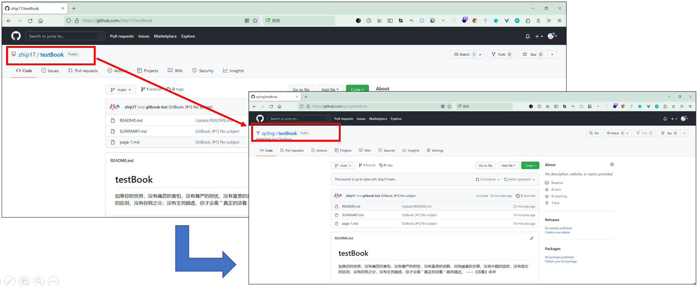
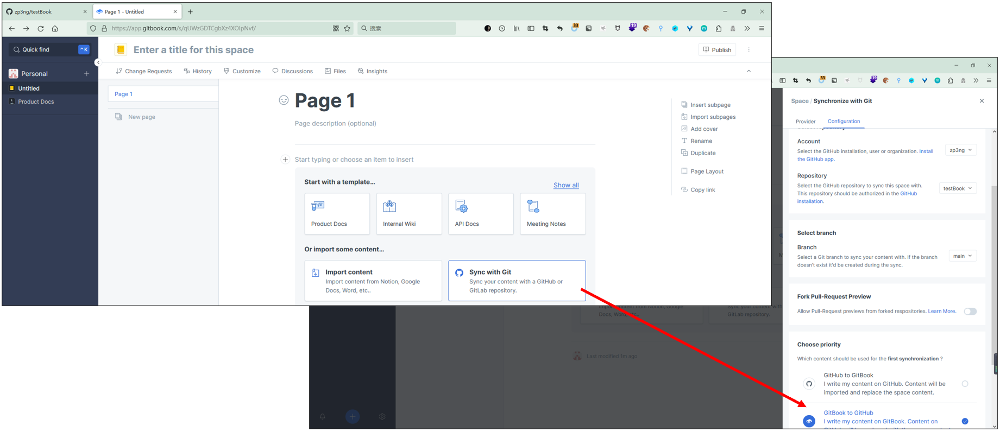
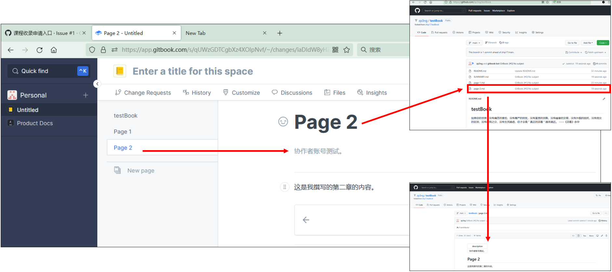
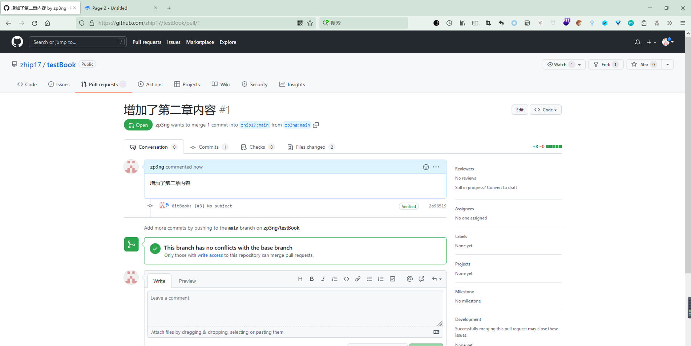
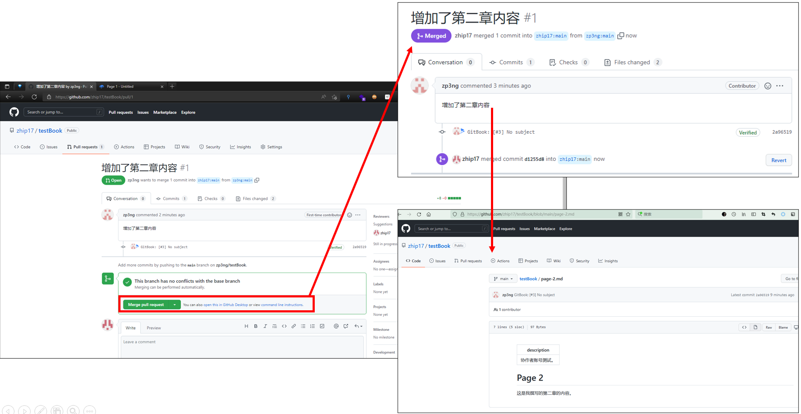

# 五、fork别人的仓库，pull request

我们知道github是开源的，因此你创建的一本书（一个仓库），网络上的任何人都是可以看到的，我们如果发现别人的代码有问题，或者想帮助别人一起出书，可以将别人的代码fork（拷贝到自己的github中）下来，改好后，给作者发送一个合并请求，如果作者发现你做的确实是对的，就可以合并你的内容，实现协同合作功能。

我们举一个老师让学生编写书籍的例子：&#x20;

我们还以test\_book这本书为例，这本书的创建过程我们已经在上一节中说过了，下面我们以zhip21这个Github账号作为学生账号：

* fork刚才我们创建的testBook仓库。
* 在Gitbook中撰写课程内容
* 发出pull request申请

1. 进入老师给的test\_book仓库地址，然后fork，“Fork”就是把一个别人的仓库复制到自己的帐户中来。

2\. 登录自己的Gitbook账户，创建space并关联刚刚Fork的仓库。关联成功后，协作者在GitBook撰写课程内容，系统将自动同步至其Github仓库。

3\. 协作者撰写完成后，在GitHub通过pull request向课程主体或老师提交课程内容。

9\. 这时老师在Github上就会得到pull request信息，点击pull request，点进test仓库  这时老师看了下信息，如果可以合并，就点击绿色按钮 Merge pull request，也可以回复Comment。

